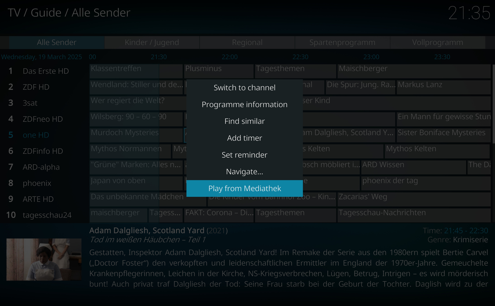

Mediathek Play lets you play programs directly from the EPG. It uses [MediathekViewWeb](https://mediathekviewweb.de) to search for the programs
so it will only work for content indexed there (e.g. German and Austrian public broadcasting channels).

The addon uses the data provided by the EPG to search for the program. Metadata used is the title, subtitle, description and the
date of the selected program. As such frequently recurring programs such as news shows will not be able to streamed
by the addon as the EPG metadata is always the same for every instance of the program. For most programs such as feature films,
documentaries or TV shows the addon works quite reliable.

> [!NOTE]
> Your EPG should handle special characters such as "ä", "ö" and "ü" correctly, if they are parsed as "a", "o" and "u" this 
> addon wil not work for programs containing these characters.

## Usage

To use the addon simply select a program in the EPG overview and open the context menu. With a keyboard this can be done
by pressing "c". Alternatively it is possible to map any key (on a remote for example) to this action. Now you will now be able to select
the option "Play from Mediathek".

## Installation

To install the addon, download the zip from the latest release and install it via the Kodi GUI.
